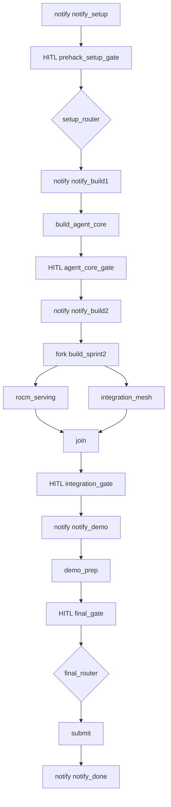

# amd-act-ii — Workflow

AMD ACT II — GrootNet hackathon delivery (build Jul 6-11). 5 roles: Platform/Infra Eng (AMD cloud/MI300X/ROCm) -> ML/Agent Eng -> Integration Eng -> Demo/Pitch Owner -> Team Lead (Accountable, hi@forenly.ai). Each handoff notifies Discord #amd-act. Track by correlationId=amd-act-ii.

Conductor: `amd_act_ii_pipeline` (v1). Roles: Platform/Infra Eng -> ML/Agent Eng -> Integration Eng -> Demo/Pitch Owner -> Team Lead (Accountable). Notifies Discord #amd-act.

